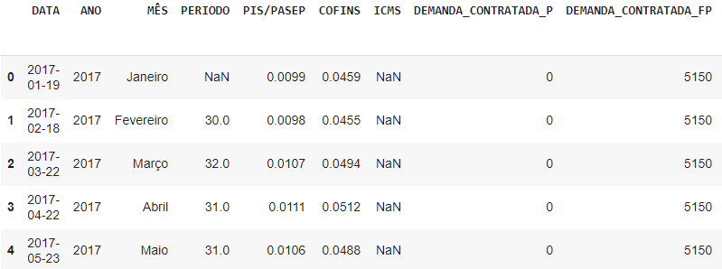
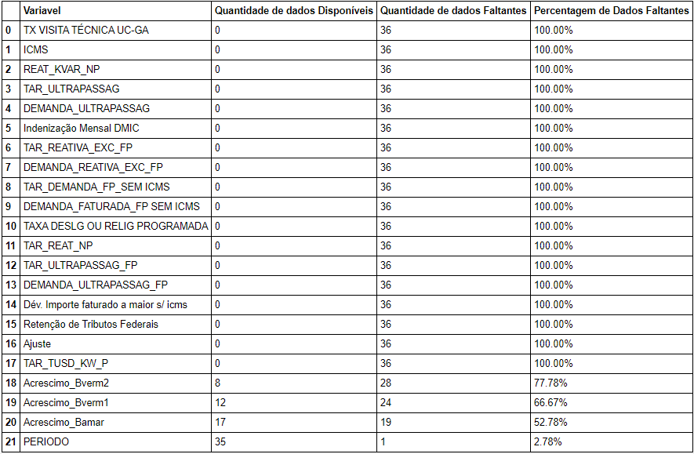
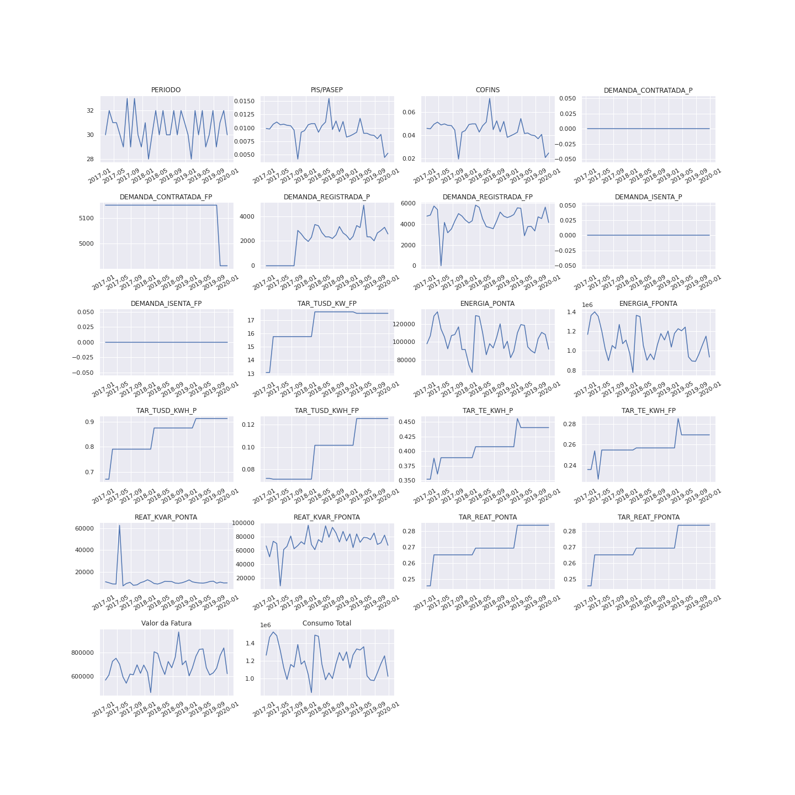

# IT304S: Contratação de Energia para Grandes Clientes
## Prof. Dr. Luiz Carlos Pereira da Silva

# UFRJ - Centro de Tecnologia/CT
## Grupo 5
* Luís Henrique Tenório Bandória
* Hever
* Douglas
* Roberto

# Introdução
Hoje o mercado de energia no Brasil apresenta benefícios para os consumidores. Obtenção de nova opção de migração do mercado cativo - Ambiente de Contratação Regulada (ACR) para Ambiente de Contratação Livre (ACL). No ACL, o consumidor pode escolher livremente seu fornecedor de energia, exercendo seu direito à portabilidade da conta de luz. Nesse ambiente, o fornecedor e o consumidor negociaram as condições de contratação de energia. Porém, para conseguir a mudança na migração de ACR para ACL, diferentes análises devem ser realizadas, tais como: dados, demanda, reativos, energia, sendo avaliados nos últimos 3 anos sujeitos a um ACR. Por outro lado, também é importante realizar análises de previsões como: demanda, produção, etc. Estas últimas análises podem ser desenvolvidas aplicando diferentes metodologias. Neste trabalho, pretende-se aplicar algumas das metodologias para determinar a possibilidade de migração para o mercado de ACL. O estudo está focado na unidade Consumidora do Centro Tecnológico da Universidade Federal do Rio de Janeiro.
 
# Objetivos
Este trabalho tem como objetivo realizar diferentes análises para determinar a possibilidade de migração de um contrato de energia elétrica do Ambiente de Contratação Regulada para o Ambiente de Contratação Livre (ACR/ACL) como medida econômica. Esta análise está limitada unidade consumidora (Centro Tecnológico - UFRJ) descrita no capítulo anterior.
	
# Definição de ciência de dados 

[texto do link](https://)A ciência de dados pode ser definida como um conjunto de técnicas de analise de dados para obter e apresentar informações úteis para um usuario. 

# Metodologia
Para conseguir prever a demanda de um mês futuro a partir dos dados disponíveis é necessário que a base de dados seja tratada. Remoção de dados nulos, remoção de outliers, imputação de dados faltantes são alguns dos pontos que podem ser analisados no banco de dados. Neste sentido, optou-se arbitrariamente por aplicar a metodologia `CRISP-DM (Cross-Industry Standard Process for Data Mining)` para a análise dos dados. Segundo esta metodologia, o problema deve ser dividido nas seguintes etapas:

* **Business Understanding:** Definição dos objetivos, declaração do problema, * * pergunta de interesse.
* **Data Understanding:** Utilização de nosso conhecimento para coletar os dados.
* **Data Preparation:** Manipulação de dados para a eliminação de outliers e dados faltantes.
* **Modeling:** Modelo ou abordagem utilizado para estudar o comportamento de nosso sistema a partir de nossos dados.
* **Evaluation:** Avaliação dos resultados obtidos, no contexto se são de ajuda para responder nossa pergunta de interesse.
* **Deployment:** Disponibilizar o análise de dados.

# Business Understanding
## Principais Considerações para a Migração para ACL

* **Definição dos objetivos:** O objetivo do presente trabalho é investigar a viabilidade da migração do CT/UFRJ para o Ambiente Livre de Contratação.

* **Declaração do problema:** Tratar os dados disóníveis das faturas e realizar a previsão da demanda.

* **Perguntas de Interesse:** É possível prever, com boa precisão, a demanda que será necessária em meses futuros?

# Data Understanding
Para todas as análises foram utilizadas as faturas mensais para os anos de 2017, 2018 e 2019. Estas faturas foram digitalizadas e estão disponíveis  em **data/Contas de energia UFRJ.xlsx.** Dessa forma, são esperados um total de 12 dados para cada categoria presente nas faturas. Como nem todas as faturas trazem dados de todas as categorias estudadas, como por exemplo as Tarifas de Ultrapassagem que são cobradas somente nos meses em que há ultrapassagem acima de 5% da demanda contratada.
Neste estudo, as categorias ENERGIA HFP VERDE, ENERGIA HP VERDE, ENERGIA HFP AMAR, ENERGIA HP AMAR, ENERGIA HFP VERM e ENERGIA HP VERM estão presentes apenas nas faturas referentes aos meses em que as bandeiras tarifárias estão sendo aplicadas. Dessa forma, nos meses em que não há bandeira tarifária aplicada não há energia consumida sob uma dada bandeira e, consequentemente, não há acréscimos na fatura por conta de bandeiras tarifárias, e, portanto, as categorias Acrescimo Bamar, Acrescimo Bverm1 e Acrescimo Bverm2 não constarão nas faturas. Contudo, mesmo que nenhuma bandeira esteja aplicada as tarifas relacionadas a cada uma das bandeiras estão presentes em todos os meses (Esta análise é mais detalhada no estudo preliminar).

# Data Preparation
As faturas de energia elétrica disponíveis foram digitalizadas em uma planilha eletrônica. Um pequeno trecho dessa planilha é mostrado abaixo. O primeiro passo é observar a presença dos valores NaN (not a number), valores que não são reconhecidos pela linguagem Python. Portanto é necessário realizar a remoção destes valroes dad base de dados, substituindo-os  por zeros uma vez que são dados não existentes.

Após a substituição dos dados NaN por zeros, é necessário identificar os dados nulos presentes na base de dados. Dados nulos tipicamente aparecem no banco de dados por falhas no preenchimento das planilhas ou falhas na comunicação entre os medidores e a base de dados, sendo necessário identifica-los. A figura abaixo mostra o total de dados para cada categoria da base de dados, juntamente com a porcentagem de dados nulos naqueles campos em que estes estão presentes.

Como têm-se dados dos anos de 2017, 2018 e 2019 espera-se que cada campo tenha um total de 36 valores. Pode ser observado que isso não é verdade para todos os campos disponíveis. Para se ter uma melhor noção dos dados faltantes é mostrado abaixo uma matriz de dados faltantes abxio, de onde pode ser observado que se há algum padrão ou algum tip ode correlção entre as variáveis faltantas.

Pode ser observado que o campo ICMS não possui nenhum dado, o que é esperado pois a UC estudada é isenta de pagar tal imposto. Os campos relacionados a bandeiras tarifárias apresentam elevado número de dados faltantes e isso pdoe ser justificado devido à natureza da aplicação das bandeiras tarifária. Além disso, não há correlação entre as bandeiras tarifárias pois essas se excluem mutuamente, isto é, apenas uma bandeira tarifária pode ser aplicada sobre o consumo por vez. Os demais campos não possuem dados pois estes dados não estão disponíveis nas faturas. Para este trabalho optou-se arbitrariamente por selecionar apenas os campos que possuem mais de 50% de dados disponíveis, isto é, apenas a variável PERÍODO. Abaixo podem ser observados o comportamento individual de cada variável estudada.

### Imputações
Buscando um banco de dados uniforme e melhor condicionado, pode-se empregar algum técnica para criar artificialmente o valor faltante da varável PERÍODO. Para este trabalho optou-se arbitrariamente em ustilizar a técnica de Imputação pela Moda. Diversas técnicas de imputação estão presentes na literatura, como imputação pela média e imputação quadrática. Contudo, como o PERÍODO é medido em dias, ou seja, é um número inteiro, a imputação pela moda se mostra mais adequada, não tendo risco de que a imputação ocorra a partir de um valor não inteiro. Abaixo é mostrado o resultado da aplicação da imputação pela moda na variável PERÍODO.

Após a remoção dos dados nulos o banco de dados fica completo, como pode ser observado a partir da matriz de dados abaixo.

### Remoção de Outliers
Outro aspecto importante é a identificação de dados com comportamento atípico, chamados outliers, que podem  ser observados nos dados. Por exemplo, o pico presente na variável REAT_KVAR_PONTA distoa muito do restante dos dados, possivelmente devido a um erro de digitalização. Uma forma simples de identificação de outliers são os chamados Box Plot, que mostram a média do valor apresentado juntamente com a margem de erro estipulada. Qualquer valor fora dessa margem de ero é chamado de outlier. Abaixo são apresentados os Box Plot de todas as variáveis estudadas

Uma vez identificados os outliers é necessários removê-los e completar o espaço deixado com alguma técnica. Neste trabalho optou-se arbitrariamente por utilizar a técnica interquartile Range para remover e subtituir os outliers. Após a substituição destes dados as variáveis podem ser observadas abaixo. É também mostrado o Box Plot após a remoção dos outliers. Alguns campos como PIS/PASEP e COFINS foram verificados nas leis e estão corretos, apesar de serem identificados pelo Box Plot ocmo outliers. Portanto, nenhuma alteração foi realizada sobre estes valores. A DEMANDA CONTRADA também apresenta outliers, porém de fato houve uma redução no valor da demanda contrada nos três meses finais de 2019 e portanto estes dados não foram alterados.

# Modeling

Uma vez que os dados foram devidamente tratados é necessária realizar a modelagem dos dados. Para isso foi utilizado arbitrariamente a modelagem Arima, um modelo utilizado para modelagem de dados periódicos. Como a intenção do trabalho é prever a demanda da UC, estes dados foram divididos em dois grupos: dados de treino e dados de teste, mostrados abaixo.

# Evaluation

Aplicando a modelagem Arima sobre esta variável obtém-se o resultado mostrado abaixo. Pode-se observar que o modelo obtido se ajusta aos dados dentro de uma margem de erro, o que mostra que é de fato possível utilizar o Arima para prever a demanda da UC estudada. Deve-se estipular uma margem de erro adequada para realizar contratações acertivas, evitando contratar menos do que o necessário, o que pode resultar em falta de abasteceimento. No mercado de energia, o excedente não é tão problemático pois pode ser revendido ao preço do PLH(PRECISA REVER ESSA SIGLA - NÃO SEI QUAL É O CERTO KKKK.)

# Deploiment

A base de dados resultante da análise realizada se encontra disponível neste repositório (data/UFRJ_-_Final.xlsx). A partir dos resultados obtidos é possível concluir que a base de dados disponível, isto é, três anos de faturas, juntamente com o tratamento de dados realizado é suficiente para prever a demanda total da UC. Com uma base de dados maior e mais completa é possível realizar previsões ainda mais acertivas. 
